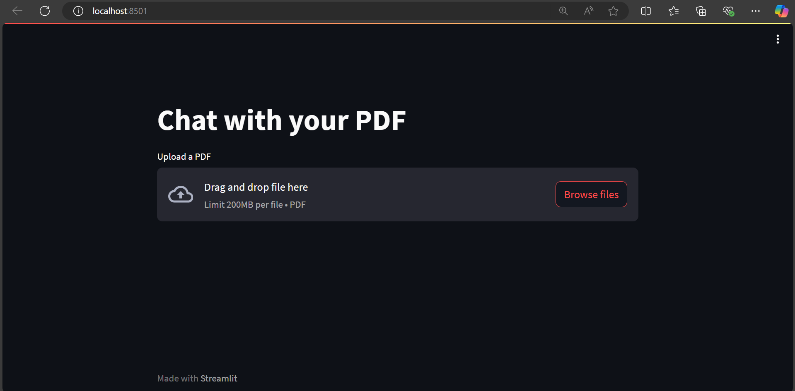

# Chat with your PDF

This application allows you to upload a PDF and ask questions about its content using natural language. It leverages embeddings from Hugging Face and a retrieval-based question-answering system.

---

## Features

- Upload PDF files.
- Extract text and create vector embeddings.
- Ask questions and get AI-powered answers.
- Easy-to-use Streamlit interface.

---

## Screenshot

Below is a preview of the app interface:



---

## Demo

Click on the image below to watch the app in action:

[](assets/demo_video.mp4)

> _Note:_ Replace `path_to_your_thumbnail.png` with the thumbnail image file and `path_to_your_video_link` with the link to your video (YouTube or any hosting service).

---

## How to Run the Application

Follow these steps to set up and run the application:

1. **Clone the repository**:

   ```bash
   git clone https://github.com/your-username/chat-with-pdf.git
   cd chat-with-pdf
   ```

2. **Install dependencies**:

   ```bash
   pip install -r requirements.txt
   ```

3. **Set up your secrets**:

   Add your Hugging Face API token to the `.streamlit/secrets.toml` file. Example:

   ```toml
   HUGGINGFACEHUB_API_TOKEN = "your_hugging_face_token"
   ```

4. **Run the application**:

   ```bash
   streamlit run app.py
   ```

---

## Requirements

The following Python libraries are required:

- `streamlit`
- `langchain`
- `faiss-cpu`
- `PyPDF2`
- `sentence-transformers`

Ensure that the required dependencies are installed as listed in `requirements.txt`.

---

## Notes

- The app uses Hugging Face embeddings (`hkunlp/instructor-base`) and LLMs (`google/flan-t5-base`) to provide answers based on the document content.
- The Hugging Face API token is required to interact with the LLMs and embeddings.
